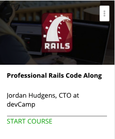

```
Roberto Nogueira  
BSd EE, MSd CE
Solution Integrator Experienced - Certified by Ericsson
```
# Professional Rails Code Along



**About This Course**

Develop a real world Rails project using TDD/BDD, including a step by step guide to building professional applications.

[Homepage](https://www.udemy.com/professional-ruby-on-rails-coding-course/)

## Topics
```
Section: 1
Planning the Application We're Going to Build
[x] 1. The Application We'll Build in the Course 7:31
[x] 2. Source code for the Application 0:00
[x] 3. Project Requirements Planning 7:32

Section: 2
Initial Application Build
[x] 4. Creating the App 3:34
[x] 5. Pushing the Application to a Remote GitHub Repository 2:44
[ ] 6. Installing RSpec and Capybara Testing Frameworks 6:08
[ ] 7. Using BDD to Build a Homepage 8:09

Section: 3
Creating a User with Test Driven Development
[ ] 8. Installing and Configuring Authentication 9:42
[ ] 9. Creating an Admin User Type Using Single Table Inheritance 8:13
[ ] 10. Implementing Data Validations via Test Driven Development 7:29

Section: 4
Implementing the Ability to Post Overtime Requests
[ ] 11. How to Use the Resource Generator for Posts 6:50
[ ] 12. Creating an Index View Using Behavior Driven Development via Capybara 6:07
[ ] 13. Creating a Seeds File to Generate Sample Data 3:46
[ ] 14. Using BDD to Create Posts and Implement CRUD 16:36
[ ] 15. Refactoring the Post Creation Process 5:13
[ ] 16. Building a Relational Connection Between Users and Posts 13:27

Section: 5
Integrate an HTML/CSS Design and Layout
[ ] 17. How to Implement the Twitter Bootstrap HTML/CSS Framework 4:20
[ ] 18. Integrate the Basic HTML Layout 13:53
[ ] 19. Creating a Rails Helper Method for Activating the Navigation Tabs 3:30

Section: 6
Listing Posts via Test Driven Development
[ ] 20. Rending a List of Posts via BDD 15:51
[ ] 21. Refactoring the Index Action to Follow Best Practices 4:51
[ ] 22. How to Create a Custom Model Method to Generate a User's Full Name 4:58

Section: 7
Installing FactoryGirl for Test Data
[ ] 23. Installing FactoryGirl for Test Data Creation 11:42
[ ] 24. How to Refactor Tests to Include Factories 10:39

Section: 8
Implementing New CRUD Functionality into the Application
[ ] 25. Implement Ability to Edit Posts via BDD 19:51
[ ] 26. Adding a Button to Create Posts 4:55
[ ] 27. Integrating the Ability to Delete Posts 12:28

Section: 9
Building Advanced User Interface Elements
[ ] 28. How to Style the Application Forms 6:57
[ ] 29. Implement Growl Notifications to Alert Users 4:56
[ ] 30. How to Implement Growl Notifications for Form Validations 6:44
[ ] 31. How to Style the Sign In Forms 6:40

Section: 10
Installing and Customizing the Admin Dashboard
[ ] 32. Removing the Ability for Users to Register 6:13
[ ] 33. Installing the Admin Dashboard via the Administrate Gem 7:16
[ ] 34. How to Customize Administrate Admin Dashboard Forms 11:28
[ ] 35. Customizing the Admin Dashboard Search Engine 11:55
[ ] 36. Blocking Non Admins from Accessing the Admin Dashboard 18:08

Section: 11
Building out the Approval Workflow
[ ] 37. Planning the Approval Workflow Feature 7:30
[ ] 38. Implementing the Enum Component to Track Workflow Statuses 11:58
[ ] 39. Customizing the Admin Dashboard to Show Approval Statuses 9:21
[ ] 40. How to Implement Radio Buttons via BDD 18:31
[ ] 41. Hiding Approval Form Elements from Non Admins 12:47
[ ] 42. How to Hide Navigation Bar Elements from Users that Aren't Signed In 7:36

Section: 12
Creating a Permission Structure to Manage App Authorization
[ ] 43. Installing Pundit for Application Permission Structure 4:28
[ ] 44. Implementing Post Permissions 13:25
[ ] 45. Implementing RSpec Tests for Permissions, Part 1 9:07
[ ] 46. Implementing RSpec Tests for Permissions, Part 2 14:36
[ ] 47. Adding Growl Notifications for Permission Alerts 4:49
[ ] 48. Integrating Permission Structures to Hide Posts from Non Authorized Users Part 1 12:06
[ ] 49. Integrating Permission Structures to Hide Posts from Non Authorized Users Part 2 13:37

Section: 13
Building Advanced Features in Rails
[ ] 50. How to Build a Custom Database Query Scope in Rails 4:00
[ ] 51. Refactoring the Integration Test Post Spec 10:27
[ ] 52. How to Lock Records in Rails 15:08
[ ] 53. Creating a Custom View Helper to Render Color Coded Labels 9:19
[ ] 54. Hiding Elements in the View Based on the Permission Structure 3:13
[ ] 55. Installing and Running the Puma Web Server 3:23
[ ] 56. Adding Overtime Hours to Posts with Validations 12:55
[ ] 57. Updating Integration Tests to Include Requested Overtime Hours 10:11
[ ] 58. Styling the Show Page View Template 8:03
[ ] 59. Integrating Icons into the Views for Edit and Delete Components 8:41

Section: 14
Implementing the Twilio API for Sending Text Messages
[ ] 60. Installing the Twilio API Gem 1:52
[ ] 61. Protecting API Credentials via the Dotenv Rails Gem 8:24
[ ] 62. Building the SMS Tool Module 8:20
[ ] 63. Creating a RSpec Stub for Sending SMS Messages 10:52

Section: 15
Creating a Custom Rake Task
[ ] 64. Building a Custom Rake Task 4:49
[ ] 65. Planning the SMS Rake Task Data Flow 5:13
[ ] 66. Adding a Phone Number to Users with Validations 16:56
[ ] 67. Implement Regular Expression Matcher for Phone Numbers 13:39
[ ] 68. Finalize the Ability to Send Text Messages 8:11

Section: 16
Building the Audit Log Functionality
[ ] 69. Planning the Audit Log Functionality 6:37
[ ] 70. Generating the Audit Log Feature Using the Resource Generator 3:18
[ ] 71. Creating a Factory for the Audit Log Using FactoryGirl 13:59
[ ] 72. Integrating Data Validations with RSpec Tests 13:37
[ ] 73. Updating the Seeds File for Accurate Sample Data 1:43
[ ] 74. Implementing a Tab for the Audit Log Dashboard only Shown to Admin Users 11:33
[ ] 75. Building the Initial Audit Log Dashboard 19:58
[ ] 76. Blocking Non Admins from the Audit Log Index Page 4:04
[ ] 77. Styling the Audit Log Dashboard 3:54
[ ] 78. Implementing the Status Enum and Label Generator for Audit Items 7:16

Section: 17
Implementing AJAX Based Pagination
[ ] 79. Integrating Pagination with Kaminari Gem 4:57
[ ] 80. Styling Pagination Throughout the Application 4:11
[ ] 81. Building AJAX Based Pagination Using JavaScript Calls 8:43

Section: 18
Building out a Monitoring Dashboard for Managers
[ ] 82. Structuring the Page Flow for Admins vs Employees 6:50
[ ] 83. Building a Monitoring Dashboard for Admins 15:34
[ ] 84. Bringing in Live Data to the Admin Management Dashboard 16:03
[ ] 85. Creating Custom Actions via Button Click for Admins 15:31
[ ] 86. Completing the Admin Dashboard Homepage 14:05

Section: 19
Building out a Monitoring Dashboard for Employees
[ ] 87. Designing Initial Employee Homepage 11:17
[ ] 88. Implementing Confirmation Buttons for Employees 17:22
[ ] 89. Building Instant Approval Functionality for Employees 16:58
[ ] 90. Complete Building Employee Homepage Feature 8:49
[ ] 91. Integrating Custom Callback for Audit Status Workflow 6:09

Section: 20
Creating the Notification Email System
[ ] 92. Building Mailer Functionality 10:25
[ ] 93. Creating Rake Task for Sending Notification Emails 13:55

Section: 21
Deploying to the Web
[ ] 94. Deploying to Heroku 11:16
[ ] 95. Fixing CSS Issues on Heroku 3:44
[ ] 96. Implementing Scheduler Tool for Running Automated Tasks 10:05
[ ] 97. Using Nil Guards for Callbacks 4:28
[ ] 98. Building Rake Task for Sending SMS Messages to Employees 16:26
[ ] 99. Installing Sparkpost Email Server 5:09
[ ] 100. Completing Email Configuration 12:28
[ ] 101. Automatically Create Audit Log Items Weekly 5:42
[ ] Quiz 1: Deployment Quiz 0:00

Section: 22
Implementing Final Application Changes
[ ] 102. Planning Final Changes 10:56
[ ] 103. Using before_update Callback to Automatically Set Confirmation Dates 5:20
[ ] 104. Update Automated Workflow Processes to Include Rejections 11:14
[ ] 105. Refactoring Buttons to be Responsive 17:30
[ ] 106. Implement Permission Structure into Nav Bar Elements 10:12
[ ] 107. Adding Single Table Inheritance Class to Administrate Dashboard 8:11
[ ] 108. Installed Honeybadger for Automated Error Notifications 7:38
[ ] 109. Course Summary 9:52

Section: 23
New Features and Rails 5 Upgrade
[ ] 110. Client Meeting Recap and Overview of New Feature Requests 8:38
[ ] 111. Utilizing GitHub as a Project Management Tool 3:30
[ ] 112. Upgrading to Rails 5 15:40

Section: 24
Parent/Child Relationships and Adding New Attributes
[ ] 113. Creating a Self Referential Relationship Between Managers and Employees 7:11
[ ] 114. Building in a has_many through relationship for Users 13:28
[ ] 115. Adding New Parameters Requested by Freelance Client 18:08

Section: 25
Mobile Responsiveness and Payroll System Creation
[ ] 116. Building in Custom Mobile Responsive Elements into the View 7:06
[ ] 117. Planning the Payroll System Development 9:33
[ ] 118. Migrating from Overtime Requests to a Full Time Tracking Solution 13:13
[ ] 119. Upgrading the Rationale Attribute to List the Full Work Performed 15:48
[ ] 120. Fixing a Poor Capybara Test 8:13
```
